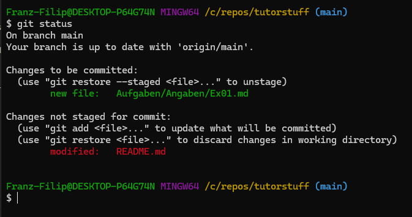

# Git Basics
Hier findest du eine kleine Beschreibung dazu, wie du mit git arbeiten kannst.

### Hinzufügen deiner Änderungen
Du kannst beliebig oft deine Änderungen hier hochladen.

Am besten gehst du so vor: Du siehst dir den momentanen Status an (`Schritt 1`).

Dann fügst du alle deine Änderungen hinzu (`Schritt 2`).

Dann führst du einen `commit` aus (das ist nichts anderes als eine Bestätigung) der Änderungen. Dafür vergibst du eine kleine Zusammenfassung. (Es ist auch ok wenn du einfach 'WIP' für Work in Progress reinschreibst)

Abschließend machst du nurnoch einen Sync mit dem Code in der Cloud und du bist fertig.

### Schritt 0
Navigiere mit der Console in das Hauptverzeichnis unseres Repository, danach kannst du die folgenden Befehle ausführen.

### Schritt 1
```
git status
```

### Schritt 2

```
git add .
```

### Schritt 3

```
git commit -m "WIP"
```
Statt WIP kannst du hier reinschreiben was du gemacht hast. (Aufgabe fertig, oder Charakter klassen erstellt)

### Schritt 3

```
git push
```